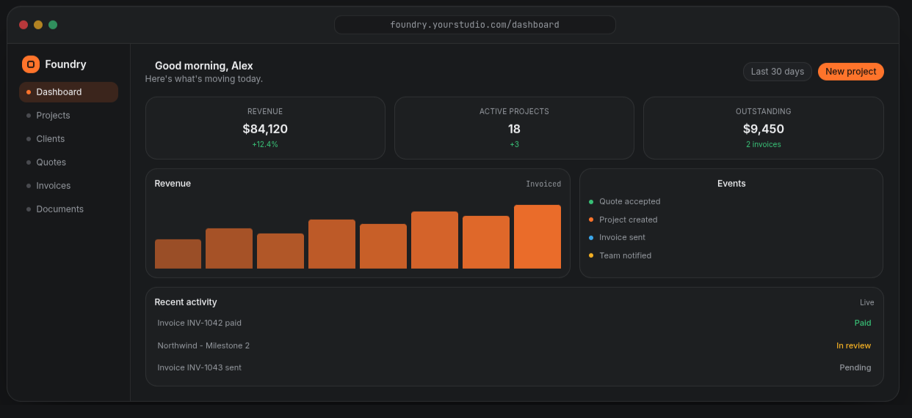

<p align="center">
  <h2 align="center"> <a href="https://foundry.tillertech.io/"> Foundry</a></h2>
  <p align="center">The modern workspace for independent consultants</p>
</p>




##  Project Overview

Foundry is the solution to consultancy management in the service industry.


- [Project Overview](#project-overview)
- [Local Development](#local-development)
  - [Docker(Recommended)](#dockerrecommended)
  - [Manual(Docs WIP)](#manualdocs-wip)
- [Notes on Architecture(WIP)](#notes-on-architecturewip)
  - [1.  Module Boundaries](#1--module-boundaries)
  - [2. Docker Integration](#2-docker-integration)
  - [3. Playwright E2E Testing](#3-playwright-e2e-testing)
  - [4. Vitest for Unit Testing](#4-vitest-for-unit-testing)
- [Project Structure(WIP)](#project-structurewip)
- [Understanding Tags](#understanding-tags)
- [Useful Commands](#useful-commands)
- [Adding New Features](#adding-new-features)
  - [Generate a new Angular application:](#generate-a-new-angular-application)
  - [Generate a new Angular library:](#generate-a-new-angular-library)
  - [Generate a new Angular component:](#generate-a-new-angular-component)
  - [Generate a new API library:](#generate-a-new-api-library)


## Local Development

### Docker(Recommended)

**Basic requirements**
- Docker
- Docker Compose


```sh
cp .env.docker.example .env.docker
docker compose -f docker-compose.local.yml up
```

If you have [just](https://just.systems/man/en/) installed:

```sh
cp .env.docker.example .env.docker
just develop
```


The complete set of commands can be found with:

```sh
just
```


### Manual(Docs WIP)

The manual setup process is (WIP)


```bash

npm install --legacy-peer-deps

# Serve the Angular client application (this will simultaneously serve the API backend)
npx nx run client:serve

# ...or you can serve the API separately
npx nx run api:serve

# Build all projects
npx nx run-many -t build

# Run tests
npx nx run-many -t test

# Lint all projects
npx nx run-many -t lint

# Run e2e tests
npx nx run client-e2e:e2e

# Run tasks in parallel

npx nx run-many -t lint test build e2e --parallel=3

# Visualize the project graph
npx nx graph
```
----


The client runs on `http://localhost:4200` and the API on `http://localhost:3000`. 

This repository demonstrates a production-ready Angular monorepo with:


## Notes on Architecture(WIP)
- **2 Applications**

  - `client` - Angular e-commerce application with product listings and detail views
  - `api` - Backend API with Docker support serving product data

- **6 Libraries**

  - `@org/feature-products` - Product listing feature (Angular)
  - `@org/feature-product-detail` - Product detail feature (Angular)
  - `@org/data` - Data access layer for client features
  - `@org/shared-ui` - Shared UI components
  - `@org/models` - Shared data models
  - `@org/products` - API product service library

- **E2E Testing**
  - `client-e2e` - Playwright tests for the client application


### 1.  Module Boundaries

Enforces architectural constraints using tags. Each project has specific dependencies it can use:

- `scope:shared` - Can be used by all projects
- `scope:client` - client-specific libraries
- `scope:api` - API-specific libraries
- `type:feature` - Feature libraries
- `type:data` - Data access libraries
- `type:ui` - UI component libraries

**Try it out:**

```bash
# See the current project graph and boundaries
npx nx graph

# View a specific project's details
npx nx show project client --web
```

[Learn more about module boundaries →](https://nx.dev/docs/features/enforce-module-boundaries)

### 2. Docker Integration

The API project includes Docker support with automated targets and release management:

```bash
# Build Docker image
npx nx run api:docker:build

# Run Docker container
npx nx run api:docker:run

# Release with automatic Docker image versioning
npx nx release
```

**Nx Release for Docker:** The repository is configured to use Nx Release for managing Docker image versioning and publishing. When running `nx release`, Docker images for the API project are automatically versioned and published based on the release configuration in `nx.json`. This integrates seamlessly with semantic versioning and changelog generation.

[Learn more about Docker integration →](https://nx.dev/docs/guides/nx-release/release-docker-images)

### 3. Playwright E2E Testing

End-to-end testing with Playwright is pre-configured:

```bash
# Run e2e tests
npx nx run client-e2e:e2e

# Run e2e tests in CI mode
npx nx run client-e2e:e2e-ci
```

[Learn more about E2E testing →](https://nx.dev/docs/technologies/test-tools/playwright)

### 4. Vitest for Unit Testing

Fast unit testing with Vite for Angular libraries:

```bash
# Test a specific library
npx nx run data:test

# Test all projects
npx nx run-many -t test
```

##  Project Structure(WIP)

```
├── apps/
│   ├── client/           [scope:client]    - Angular e-commerce app
│   ├── client-e2e/                       - E2E tests for client
│   └── api/            [scope:api]     - Backend API with Docker
├── packages/
│   ├── client/
│   │   ├── feature-products/        [scope:client,type:feature] - Product listing
│   │   ├── feature-product-detail/  [scope:client,type:feature] - Product details
│   │   ├── data/                    [scope:client,type:data]    - Data access
│   │   └── shared-ui/               [scope:client,type:ui]      - UI components
│   ├── api/
│   │   └── products/    [scope:api]    - Product service
│   └── shared/
│       └── models/      [scope:shared,type:data] - Shared models
├── nx.json             - Nx configuration
├── tsconfig.json       - TypeScript configuration
└── eslint.config.mjs   - ESLint with module boundary rules
```

##  Understanding Tags

This repository uses tags to enforce module boundaries:

| Project            | Tags                         | Can Import From              |
| ------------------ | ---------------------------- | ---------------------------- |
| `client`             | `scope:client`                 | `scope:client`, `scope:shared` |
| `api`              | `scope:api`                  | `scope:api`, `scope:shared`  |
| `feature-products` | `scope:client`, `type:feature` | `scope:client`, `scope:shared` |
| `data`             | `scope:client`, `type:data`    | `scope:shared`               |
| `models`           | `scope:shared`, `type:data`  | Nothing (base library)       |

##  Useful Commands

```bash
# Project exploration
npx nx graph                                    # Interactive dependency graph
npx nx list                                     # List installed plugins
npx nx show project client --web                 # View project details

# Development
npx nx run client:serve                              # Serve Angular app
npx nx run api:serve                               # Serve backend API
npx nx run client:build                              # Build Angular app
npx nx run data:test                               # Test a specific library
npx nx run feature-products:lint                   # Lint a specific library

# Running multiple tasks
npx nx run-many -t build                       # Build all projects
npx nx run-many -t test --parallel=3          # Test in parallel
npx nx run-many -t lint test build            # Run multiple targets

# Affected commands (great for CI)
npx nx affected -t build                       # Build only affected projects
npx nx affected -t test                        # Test only affected projects

# Docker operations
npx nx run api:docker:build                        # Build Docker image
npx nx run api:docker:run                          # Run Docker container
```

##  Adding New Features

### Generate a new Angular application:

```bash
npx nx g @nx/angular:app my-app
```

### Generate a new Angular library:

```bash
npx nx g @nx/angular:lib my-lib
```

### Generate a new Angular component:

```bash
npx nx g @nx/angular:component my-component --project=my-lib
```

### Generate a new API library:

```bash
npx nx g @nx/node:lib my-api-lib
```

You can use `npx nx list` to see all available plugins and `npx nx list <plugin-name>` to see all generators for a specific plugin.
